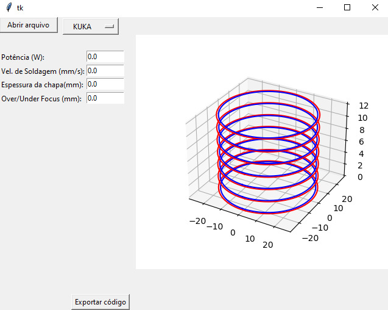

Claro, Vitor! Acessei o repositório do **gcode_robo** e observei que já existe um arquivo `README.md` com uma breve descrição. Para aprimorá-lo, sugiro incluir seções detalhadas que forneçam uma visão mais completa do projeto. Aqui está uma proposta de estrutura para o `README.md`:

---

# gcode_robo
<div style="display: inline_block"><br>
    
    
</div>

## Descrição

O **gcode_robo** é uma ferramenta desenvolvida para converter arquivos G-code, gerados por softwares de fatiamento como o Repetier Host, em programas compatíveis com robôs industriais. Isso permite que robôs executem trajetórias originalmente planejadas para impressoras 3D, ampliando suas aplicações em áreas como manufatura aditiva, usinagem e outras operações automatizadas.

## Funcionalidades

- **Conversão de G-code para linguagens de robôs industriais**: Suporta a tradução de comandos G-code para formatos específicos de diferentes fabricantes de robôs.
- **Compatibilidade com múltiplas plataformas**: Desenvolvido em Python, garantindo portabilidade e facilidade de uso em diversos sistemas operacionais.
- **Extensibilidade**: Arquitetura modular que permite a adição de novos conversores para diferentes modelos e marcas de robôs.

## Estrutura do Projeto

- `app/`: Diretório contendo a aplicação principal e interfaces de usuário.
- `gcode_parser.py`: Módulo responsável por analisar e interpretar os arquivos G-code.
- `gcode_to_jbi.py`: Script de conversão de G-code para o formato `.jbi` utilizado por robôs da Yaskawa.
- `gcode_to_src.py`: Script de conversão de G-code para o formato `.src` utilizado por robôs da KUKA.
- `gcodeToSrcDat.py`: Script auxiliar para geração de arquivos `.src` e `.dat` para robôs KUKA.
- `io.py`: Módulo de funções de entrada e saída, incluindo leitura e escrita de arquivos.
- `model.py`: Definições de classes e estruturas de dados utilizadas no projeto.

## Pré-requisitos

- Python 3.9
- Bibliotecas listadas em `requirements.txt` (se aplicável)

## Instalação

1. Clone este repositório:
   ```bash
   git clone https://github.com/vitorshaft/gcode_robo.git
   cd gcode_robo
   ```
2. (Opcional) Crie um ambiente virtual:
   ```bash
   python -m venv venv
   source venv/bin/activate  # No Windows, use `venv\Scripts\activate`
   ```
3. Instale as dependências necessárias:
   ```bash
   pip install -r requirements.txt
   ```

## Uso

1. Prepare o arquivo G-code utilizando o Repetier Host ou outro software de fatiamento de sua preferência.
2. Execute o script de conversão correspondente ao seu robô. Por exemplo, para um robô KUKA:
   ```bash
   python gcode_to_src.py caminho/para/seu/arquivo.gcode
   ```
   Isso gerará arquivos `.src` e `.dat` que podem ser transferidos para o controlador do robô.

## Contribuição

Contribuições são bem-vindas! Sinta-se à vontade para abrir issues para relatar bugs ou sugerir melhorias. Para contribuir com código:

1. Faça um fork do projeto.
2. Crie uma branch para sua feature ou correção:
   ```bash
   git checkout -b minha-feature
   ```
3. Faça commit das suas alterações:
   ```bash
   git commit -m 'Adiciona nova funcionalidade'
   ```
4. Envie para o repositório remoto:
   ```bash
   git push origin minha-feature
   ```
5. Abra um Pull Request detalhando suas alterações.

## Licença

Este projeto está licenciado sob a licença MIT. Consulte o arquivo `LICENSE` para mais informações.